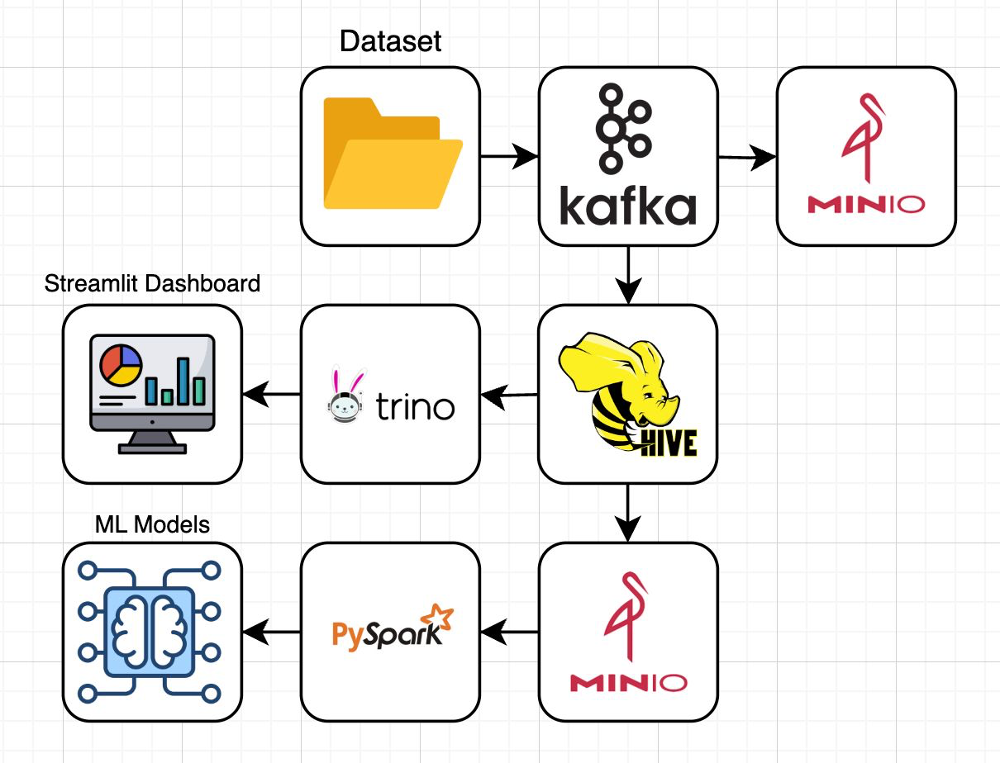

# App Recommendation System - Big Data & Data Lakehouse
## Final Project Big Data & Data Lakehosue

Aplikasi rekomendasi aplikasi Android dengan arsitektur big data dan data lakehouse menggunakan teknologi modern untuk streaming, storage, dan machine learning.

## Anggota Kelompok (A3)
| No             | Nama | NRP |
| :---------------- | :------ | :---- |
| 1        |   Nafi Firdaus    | 5027231045 |
| 2           |   Tio Axelino   | 5027231065 |
| 3    |  Dionisius Marcel   | 5027231044 |
| 4 |  Fikri Aulia As Sa'adi   | 5027231026 |
| 5 |  Muhammad Andrean Rizq Prasetio    | 5027231052 |

## Dataset

| Dataset             | Jenis | Link |
| :---------------- | :------ | :---- |
| Google Play Apps and Games (3.4M)        |   Structured    | https://www.kaggle.com/datasets/tapive/google-play-apps-and-games |
| Google Play Apps and Games (3.4M) (Summary Column)           |   Unstructured   | https://www.kaggle.com/datasets/tapive/google-play-apps-and-games |

## Latar Belakang Masalah
Google Play Store memiliki lebih dari 3 juta aplikasi, namun hanya sebagian kecil yang mendapatkan visibilitas tinggi. Sebagian besar pengguna:
- Hanya melihat aplikasi populer atau yang ditampilkan di halaman utama
- Tidak menemukan aplikasi yang relevan, unik, atau sesuai kebutuhan pribadi
- Melewatkan aplikasi niche berkualitas tinggi karena kurangnya sistem rekomendasi yang menjangkau long-tail apps

#### Permasalahan utama:
Banyak aplikasi bagus tidak terekspos ke pengguna yang tepat, menyebabkan rendahnya jumlah unduhan dan potensi ekonomi yang tidak termanfaatkan.

## Tujuan Proyek
- Membangun Sistem Rekomendasi Aplikasi Otomatis Menggunakan machine learning untuk mencari aplikasi serupa berdasarkan fitur, nama, dan rating.
- Menerapkan Arsitektur Data Lakehouse Menggunakan Kafka (streaming), MinIO (storage), Hive (metastore), dan Spark (analitik).
- Mengintegrasikan Antarmuka Web Interaktif Website berbasis Streamlit yang memungkinkan pengguna
- Mengatasi Ketimpangan Eksposur Aplikasi Long-Tail Dengan rekomendasi otomatis berdasarkan fitur konten, klasifikasi kategori, dan analisis deskriptif.

## Arsitektur Sistem


### Komponen Utama:

1. **Kafka** - Stream processing untuk real-time data
2. **MinIO** - S3-compatible object storage sebagai data lake
3. **Hive Metastore** - Metadata management
4. **Trino** - Distributed SQL query engine
5. **PySpark** - Machine learning dan big data processing
6. **Streamlit** - Real-time dashboard dan visualisasi

## Quick Start

### Prerequisites

- Docker & Docker Compose
- Python 3.8+
- 8GB RAM minimum
- 20GB storage space

### 1. Clone dan Setup

```bash
# Clone repository
git clone <repository-url>
cd fpbigdata

# Install Python dependencies
pip install -r requirements.txt
```

### 2. Jalankan Sistem

```bash
# Jalankan setup otomatis
python orchestrator.py

# Atau manual step-by-step
docker-compose up -d
python setup_hive_tables.py
python kafka_producer.py &
python kafka_consumer.py &
python ml_training.py
```

### 3. Akses Dashboard

- **Streamlit Dashboard**: http://localhost:8501
- **MinIO Console**: http://localhost:9001
- **Trino UI**: http://localhost:8086

## Fitur Dashboard

### 1. Real-time Stream

- Live monitoring interaksi user dengan aplikasi
- Metrics real-time (active users, popular apps, dll)
- Visualisasi interaction patterns

### 2. Historical Analytics

- Analisis trend aplikasi berdasarkan periode
- User behavior analysis
- Revenue analysis (free vs paid apps)
- Genre popularity trends

### 3. ML Insights

- Model performance metrics
- User clustering results
- Recommendation preview
- Feature importance analysis

### 4. System Status

- Health monitoring semua services
- Performance metrics
- Data flow visualization
- System logs

## Machine Learning

### Algoritma yang Digunakan:

1. **Collaborative Filtering (ALS)**

   - Matrix factorization untuk user-item interactions
   - Handling implicit feedback
   - Cold start problem mitigation

2. **Content-Based Filtering**
   - App feature similarity
   - Genre-based recommendations
   - K-Means clustering untuk app grouping

### Features:

- **User Features**: Interaction history, preferred genres, rating patterns
- **App Features**: Genre, rating, price, developer, install count
- **Interaction Features**: View, download, rate, search patterns

## Data Flow

### 1. Data Ingestion

```python
Dataset CSV → Kafka Producer → Kafka Topic (app-recommendations)
```

### 2. Data Storage

```python
Kafka Consumer → Parquet Files → MinIO Data Lake
                      ↓
                Hive Metastore (Metadata)
```

### 3. Data Processing

```python
MinIO → PySpark → ML Models → MinIO (Model Artifacts)
MinIO → Trino → SQL Analytics → Dashboard
```

### 4. Data Visualization

```python
Kafka Stream → Real-time Dashboard
MinIO Data → Historical Analytics
ML Models → Recommendation Interface
```

## Struktur Data

### App Interactions Schema

```sql
- timestamp: TIMESTAMP
- user_id: VARCHAR
- event_type: VARCHAR
- interaction_type: VARCHAR (view, download, rate, search)
- session_id: VARCHAR
- app_id: VARCHAR
- title: VARCHAR
- developer: VARCHAR
- genre: VARCHAR
- price: DOUBLE
- rating: DOUBLE
- installs: BIGINT
- free: BOOLEAN
- popularity_tier: VARCHAR
- rating_category: VARCHAR
- contains_ads: BOOLEAN
- in_app_purchase: BOOLEAN
- processed_at: TIMESTAMP
```

### Partitioning Strategy

```
year=YYYY/month=MM/day=DD/hour=HH/batch_timestamp.parquet
```

## Konfigurasi

### Docker Services

| Service        | Port       | Description        |
| -------------- | ---------- | ------------------ |
| Kafka          | 9092       | Message streaming  |
| Zookeeper      | 2181       | Kafka coordination |
| MinIO          | 9000, 9001 | Object storage     |
| Trino          | 8086       | SQL query engine   |
| Hive Metastore | 9083       | Metadata service   |
| MariaDB        | 3306       | Metastore database |
| Streamlit      | 8501       | Dashboard          |

### Environment Variables

```env
# MinIO
MINIO_ROOT_USER=minio_access_key
MINIO_ROOT_PASSWORD=minio_secret_key

# Database
MYSQL_ROOT_PASSWORD=admin
MYSQL_USER=admin
MYSQL_PASSWORD=admin
MYSQL_DATABASE=metastore_db

# Kafka
KAFKA_BROKER_ID=1
KAFKA_ZOOKEEPER_CONNECT=zookeeper:2181
```

## Monitoring & Observability

### Key Metrics

- **Throughput**: Records/second processed
- **Latency**: End-to-end processing time
- **Storage**: Data lake size growth
- **Model Performance**: RMSE, precision, recall
- **User Engagement**: Active users, session duration

### Health Checks

- Service availability monitoring
- Data pipeline status
- Model freshness checks
- Storage capacity monitoring

## Development

### Menambah Fitur Baru

1. **Stream Processing**: Edit `kafka_producer.py` dan `kafka_consumer.py`
2. **ML Models**: Modify `ml_training.py`
3. **Dashboard**: Update `streamlit/app.py`
4. **Schema Changes**: Update `setup_hive_tables.py`

### Testing

```bash
# Test Kafka connectivity
python -c "from kafka import KafkaProducer; print('Kafka OK')"

# Test MinIO connectivity
python -c "from minio import Minio; print('MinIO OK')"

# Test Trino connectivity
python -c "import trino; print('Trino OK')"
```

### Debugging

```bash
# Check container logs
docker-compose logs kafka
docker-compose logs minio
docker-compose logs trino

# Check data in MinIO
mc ls minio/app-recommendation-data

# Query Trino
trino --server localhost:8086 --catalog hive --schema app_recommendations
```

## Troubleshooting

### Common Issues

1. **Kafka Connection Error**

   ```bash
   # Check if Kafka is running
   docker-compose ps kafka

   # Restart Kafka
   docker-compose restart kafka
   ```

2. **MinIO Access Denied**

   ```bash
   # Check credentials in docker-compose.yml
   # Verify bucket exists in MinIO console
   ```

3. **Trino Query Timeout**

   ```bash
   # Increase query timeout
   # Check Hive metastore connection
   docker-compose logs hive-metastore
   ```

4. **Out of Memory**
   ```bash
   # Increase Docker memory allocation
   # Reduce Spark executor memory in ml_training.py
   ```

### Performance Tuning

1. **Kafka**: Adjust `batch.size` dan `linger.ms`
2. **Spark**: Configure `spark.executor.memory` dan `spark.driver.memory`
3. **Trino**: Tune `query.max-memory` dan `query.max-memory-per-node`
4. **MinIO**: Use multiple drives untuk better I/O

## TODO / Future Enhancements

- [ ] Real-time model retraining
- [ ] A/B testing framework
- [ ] Advanced user segmentation
- [ ] Deep learning models (TensorFlow/PyTorch)
- [ ] Real-time feature store
- [ ] Data quality monitoring
- [ ] Automated model deployment
- [ ] Multi-tenant support
- [ ] Advanced security features
- [ ] API endpoints untuk external integration